# CarePulse developer guide

For reproducible commands and environment variables, start with [README](../README.md). For database preservation, use [DATABASE_UPGRADE](DATABASE_UPGRADE.md). The older project specification describes the intended design; [IMPLEMENTATION_STATUS](IMPLEMENTATION_STATUS.md) records actual behavior and verification.

## Integration contracts

- One API root: `/api/v1`. Both clients send the same Identity-issued JWT. Public registration is Patient-only. Admin provisions staff; active doctor/nurse profiles are checked even for an existing token.
- Resource IDs are different: Identity `UserId` is a string; patient/doctor/nurse profile IDs, slot IDs and dispatch IDs are GUIDs. Never substitute one for another or use a demo ID.
- The patient profile owns triage and bookings. A consultation derives its patient/doctor from the booked slot. Nurses can read/update only their own dispatches. Doctor approval records the acting user; assignment requires that approving doctor or Admin.
- UI success follows a successful API response. HTTP 400 means validation; 401 means reauthenticate; 403 means forbidden; 409 means refresh/reconcile state, not blindly repeat a new action.
- Store timestamps in UTC. Roster dates/times and AI date filters use Asia/Colombo; display the chosen timezone clearly. Booking past slots and premature consultation completion are rejected.
- `xmin` protects concurrent booking/triage/nurse/dispatch/workflow updates. DB uniqueness also prevents duplicate active nurse assignments, duplicate case dispatch and duplicate completion vitals. Business commands and workflow events save atomically.
- Medical files have no public URL. Use the JWT-protected download action. Never put uploads back in static hosting or Git.

## Executing workflow

```mermaid
flowchart LR
  P[Patient submits symptoms] --> C[Planner: validated delegation]
  C --> D[Domain analysis: bounded risk assessment]
  D --> A[Action agent: read-only slot search]
  A --> V[Safety: deterministic rules plus optional Gemini]
  V --> H{Doctor review required?}
  H -->|Yes| Q[Persist review queue]
  Q --> R[Doctor approves or rejects]
  R --> W[Approved case waits for nurse]
  W --> N[Authorized assignment with safety acknowledgement]
  N --> L[Assigned nurse sends GPS and confirms arrival]
  L --> F[Persist vitals and release nurse]
  F --> U[Patient sees completed visit]
  H -->|No| U
```

`TriageWorkflowRunner` executes the four steps and links `AiWorkflow.TriageTicketId`. Scheduling uses a typed allow-listed search for this workflow; the separate natural-language search endpoint uses Gemini function calling. Standalone plan creation remains planning-only and cannot approve a linked triage workflow.

`ExecutionJson` stores structured summaries, tool outcomes and timing, not hidden chain-of-thought. Human approvals, assignment, escalation and completion append events. Model failures require clinical review; they never dispatch automatically. A periodic recovery worker marks Running workflows older than ten minutes for manual review. It does not replay writes or promise continuation of an interrupted model call. The worker is disabled in the Testing host; its recovery method is tested directly. A crash before the triage link is saved may leave only the workflow record; inspect it before resubmitting.

## AI boundaries

All active providers use `AI:GeminiApiKey` and `AI:GeminiModel`. Gemini transport has a 45-second budget and at most one retry for 429/5xx; safety's Semantic Kernel call has its own 30-second bound and rule fallback. Model JSON is parsed and validated; tool names/arguments are allow-listed. Provider content cannot grant roles, approve a case or book a slot. Safety warnings require an explicit human acknowledgement at assignment.

Email/long-identifier minimization is **not** full anonymization of arbitrary prose. Names, addresses and clinical details can remain. No universal privacy interception agent or proven clinical classifier is implemented. Use synthetic data for evaluation and obtain a real data-governance design before processing real patient records with external models. Structured JSON constrains syntax, not medical truth; see [Gemini structured output](https://ai.google.dev/gemini-api/docs/structured-output) and [safety guidance](https://ai.google.dev/gemini-api/docs/safety-guidance).

## Development and review

Use feature branches and review into develop, then main. One migration snapshot lives under Data/Migrations even though historical migration files are in two directories. Do not scaffold migrations from stale snapshots. Run backend PostgreSQL tests and affected client checks before sharing; CI includes all three applications. Never pass the shared Neon connection as `CAREPULSE_TEST_CONNECTION`.

The audit introduced broad integration changes. Each student should run their own manual cases, inspect the related diff and explain it in their own words. Keep actual commits/PRs/reviews, AI-assistance logs, measured results and screenshots. Do not label simulated SMS/straight-line ETA as production integrations or deterministic provider fakes as live-model evaluation.
